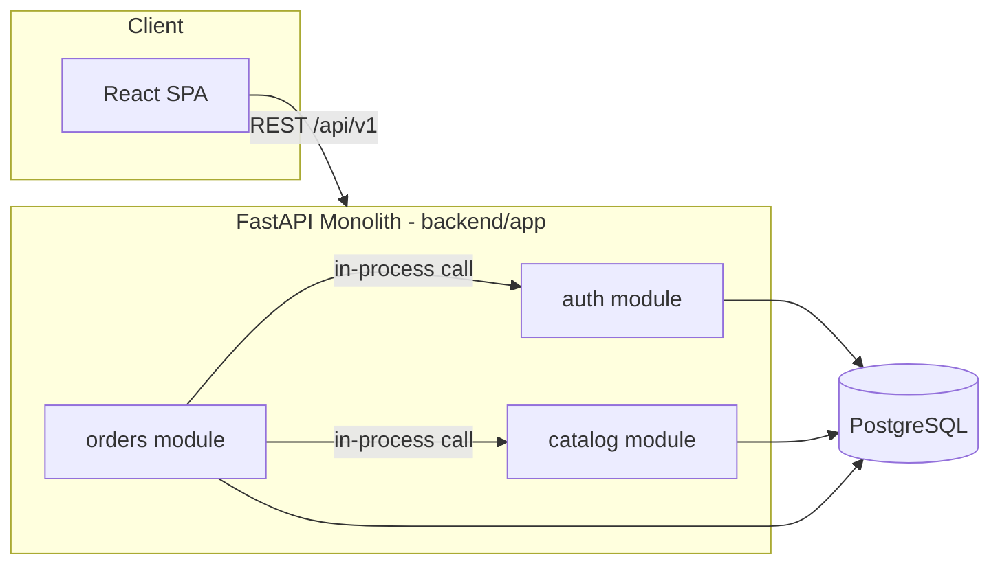

# Architecture

See [ADR-0001](adr/0001-architecture-overview.md) for the decision record.
This document is the map every team works from. Do not deviate from it
without updating this file and getting Main Coordinator sign-off.

## System diagram



## Module boundaries

| Module    | Owns tables                                                    | Exposes                          | May call            |
|-----------|------------------------------------------------------------------|-----------------------------------|----------------------|
| auth      | users, refresh_tokens, invitations, password_reset_tokens        | register/login/refresh/logout, invitations, password reset, admin user management, `get_current_user`/`require_role` dependencies | audit (log actions), email (send invitation/reset emails) |
| catalog   | categories, brands, products, product_images                     | product/category/brand CRUD + search | nothing else |
| orders    | carts, cart_items, orders, order_items, order_status_history, invoices | cart + checkout + order history + invoice download + admin order management | catalog (product price/stock), auth (current user), addresses (resolve shipping/billing), payments (process/refund), email (order confirmation) |
| addresses | addresses                                                          | self-service address book CRUD    | nothing else |
| payments  | payments                                                            | payment provider adapters (`CODProvider`, `TestCardProvider`) — no HTTP endpoints, driven entirely by `orders` | nothing else |
| media     | (none — files on disk under `media_storage/`)                       | image upload, served via `/media` static mount | nothing else |
| audit     | audit_logs                                                           | `log_action()` + admin-only audit log listing | nothing else |
| email     | (none)                                                                | `send_email()` + HTML templates, called via `BackgroundTasks` | nothing else |

Rule: a module may **import another module's service-layer functions and
Pydantic schemas**, but never another module's SQLAlchemy models or raw
tables. This is enforced by code review, not tooling, for the foundation
slice.

## Folder structure

```
backend/
  app/
    main.py                 # FastAPI app, mounts routers, exception handlers
    core/
      config.py             # env-based settings (pydantic-settings)
      db.py                 # async engine/session factory
      security.py           # JWT encode/decode, password hashing
      dependencies.py       # get_db, get_current_user re-exports
      errors.py             # AppError + shared HTTP exception handlers
    shared/
      base_model.py         # declarative Base, UUID pk mixin, timestamp mixin
      pagination.py         # Page[T] schema + paginate() helper
      error_codes.py         # central enum of error codes (see CONTRACTS.md)
    modules/
      auth/
        models.py schemas.py service.py router.py dependencies.py
        tests/
      catalog/
        models.py schemas.py service.py router.py
        tests/
      orders/
        models.py schemas.py service.py router.py
        tests/
  migrations/                # Alembic
  tests/conftest.py          # shared pytest fixtures (test db, client)

frontend/
  src/
    api/                     # typed fetch clients per module
    context/                 # AuthContext, CartContext
    pages/
    components/
    App.tsx main.tsx
```

## Future modules (not built in this slice)

Inventory, real payment gateways, multi-channel notifications, search,
AI, fraud detection, analytics, DevOps/K8s. See `docs/FUTURE_MODULES.md`
for the interface stubs each would implement, so the foundation slice
does not need to be reworked when they land.
