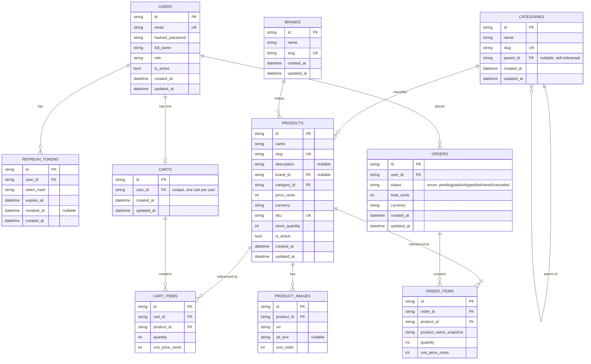

# Database Schema

Owned by the Database Team. This documents the SQLAlchemy models in
`backend/app/modules/{auth,catalog,orders}/models.py` and the Alembic
migration `fba07ec420be_create_foundation_schema` that creates them, per
the field lists in [`CONTRACTS.md`](./CONTRACTS.md).

> Note: `CONTRACTS.md` defines 10 tables across the three modules (`users`,
> `refresh_tokens`, `categories`, `brands`, `products`, `product_images`,
> `carts`, `cart_items`, `orders`, `order_items`). All 10 are modeled and
> migrated below.

## Entity-relationship diagram

## Model notes

- All primary keys are string-form UUID v4 (`UUIDPKMixin`), matching the
  "all entity IDs are UUID v4, string form" convention in `CONTRACTS.md`.
  They are stored as `VARCHAR`, not a native Postgres `UUID` column.
- Money is always an integer minor-units column (`*_cents`) plus a
  separate `currency` string — never a float — per `CONTRACTS.md`.
- `orders.status` is a native Postgres `ENUM` (`order_status`) backed by a
  Python `str` enum (`OrderStatus`) with lower-case values
  (`pending`, `paid`, `shipped`, `delivered`, `cancelled`).
- Per the module-boundary rule in `ARCHITECTURE.md`, `orders` models only
  declare raw foreign keys into `users`/`products` (by table name) — they
  do not `relationship()` into or import `auth`/`catalog` model classes.

## Indexing choices

- **Uniqueness enforced at the DB layer, not just the app layer**, for
  every natural business key called out in `CONTRACTS.md`:
  - `users.email` — unique index, since login/registration looks users up
    by email and must reject duplicate accounts atomically.
  - `categories.slug`, `brands.slug`, `products.slug` — unique indexes,
    since slugs are used for human-readable/SEO-friendly lookups and must
    not collide.
  - `products.sku` — unique index, since SKU is the canonical
    inventory/catalog identifier.
  - `carts.user_id` — unique index, enforcing "one cart per user" directly
    in the schema rather than relying on application logic.
- **Foreign key columns are indexed** (`refresh_tokens.user_id`,
  `categories.parent_id`, `products.brand_id`, `products.category_id`,
  `product_images.product_id`, `cart_items.cart_id`,
  `cart_items.product_id`, `orders.user_id`, `order_items.order_id`,
  `order_items.product_id`) so that the common access patterns — "all
  tokens/cart items/order items for X" and category tree traversal — are
  index-backed lookups rather than sequential scans, since Postgres does
  not automatically index FK columns.
- `refresh_tokens.token_hash` is indexed (non-unique) to make refresh/
  logout lookups by hash fast; it is intentionally not declared unique at
  the DB level since token issuance/rotation is the Security team's
  responsibility, not a schema-level guarantee.

## Migration

- Revision `fba07ec420be` ("create foundation schema") creates all 10
  tables above plus the `order_status` Postgres enum type.
- The migration is written to be reversible: `downgrade()` explicitly
  drops the `order_status` enum type after dropping the `orders` table.
  This is required because `op.drop_table()` does not automatically drop
  Postgres enum types the way `Base.metadata.drop_all()` does — without
  the explicit drop, a `downgrade` followed by `upgrade` fails with
  `type "order_status" already exists`. Verified locally via
  `upgrade head` -> `downgrade base` -> `upgrade head` against the running
  Postgres instance.
